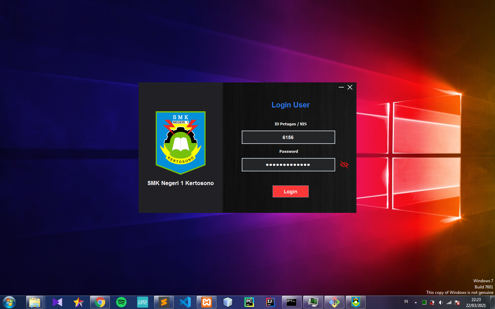
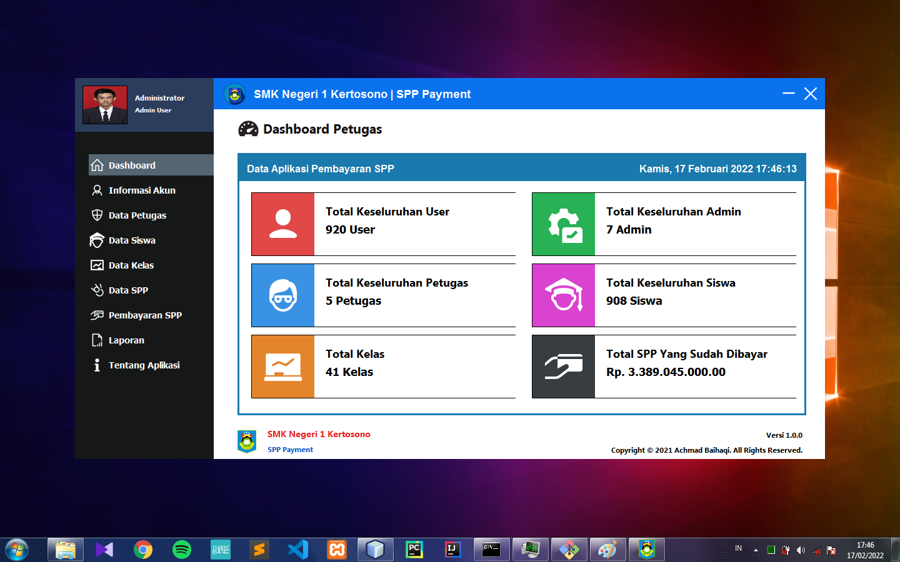
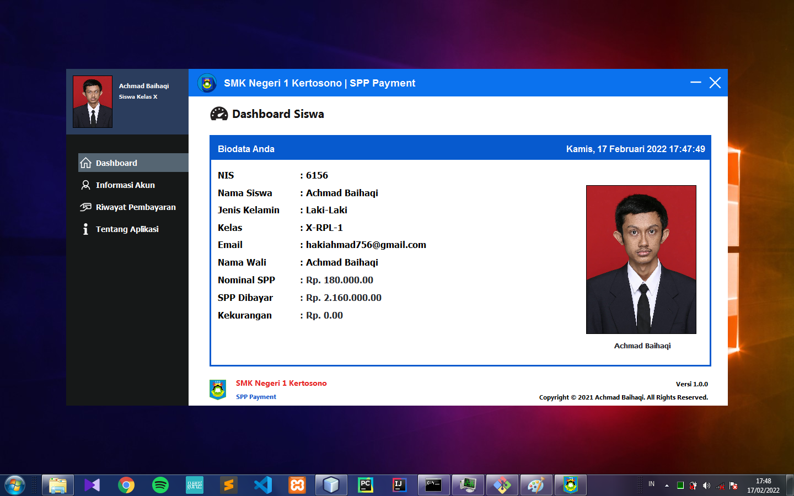

<h1 align="center">Aplikasi Pembayaran SPP</h1>

 

  

 

<!-- Project Shields -->

  [![Repo Size][repo-shield]][repo-url]
  [![License][license-shield]][license-url]
  [![Last Commit][commit-shield]][commit-url]

  [repo-shield]: https://img.shields.io/github/repo-size/HaqiAchmad/spp-payment.svg?style=for-the-badge
  [repo-url]: https://img.shields.io/github/repo-size/HaqiAchmad/spp-payment.svg
  [commit-shield]: https://img.shields.io/github/last-commit/HaqiAchmad/spp-payment.svg?style=for-the-badge
  [commit-url]: https://img.shields.io/github/last-commit/HaqiAchmad/spp-payment.svg
  [license-shield]: https://img.shields.io/github/license/HaqiAchmad/spp-payment.svg?style=for-the-badge
  [license-url]: https://github.com/HaqiAchmad/spp-payment/blob/main/LICENSE.md

<!-- Table of Contents -->

  
Table of Contents

  <ol>
    <li><a href="#deskripsi-project">Deskripsi Project</a></li>
    <li>
      <a href="#contoh-tampilan-aplikasi">Tampilan Aplikasi</a>
      <ul>
        <li><a href="#tampilan-login-">Tampilan Login</a></li>
        <li><a href="#dashboard-petugas-">Dashboard Petugas</a></li>
        <li><a href=#dashboard-siswa->Dashboard Siswa</a></li>        
      </ul>
    </li>
    <li>
      <a href="#cara-menjalankan-aplikasi">Cara Menjalankan Aplikasi</a>
      <ul>
        <li><a href=#mendownload-data-aplikasi->Mendownload data aplikasi</a></li>
        <li><a href="#menjalankan-aplikasi-di-ide-">Menjalankan Aplikasi di IDE</a></li>
        <li><a href="#default-akun-">Default Akun</a></li>
      </ul>
    </li>
    <li><a href="#persyaratan-sistem-minimal">Persyaratan Sistem Minimal</a></li>
    <li><a href="#contributor">Contributor</a></li>
    <li><a href="#catatan">Catatan</a></li>
  </ol>

## Deskripsi Project
Aplikasi ini merupakan project Uji Kopetensi Keahlian [SMKN 1 Kertosono](https://smkn1kts.sch.id/) tahun pelajaran 2020/2021 yang dilaksanakan pada tanggal 29 Maret 2021. 

## Contoh Tampilan Aplikasi
### Tampilan Login :

### Dashboard Petugas : 

### Dashboard Siswa : 

## Cara Menjalankan Aplikasi

### Mendownload data aplikasi :
- Silahkan Anda mendownload data dari Aplikasi Pembayaran SPP [disini](https://drive.google.com/uc?export=download&id=1a7ZfiqQ41-pH_-YvWtCkSbZUFkXcvkj3)
- Ekstrak data aplikasi yang sudah didownload
- Pindahkan data aplikasi ke package _src/com/resources/image/user-profile_ yang ada dikomputer Anda

### Menjalankan Aplikasi di IDE :
- Import database aplikasi ke MySQL
- Buka project di IDE
- Tambahkan file library yang ada didalam folder _lib_ ke dalam project
- Klik run untuk menjalankan aplikasi
- Silahkan login dengan akun yang tersedia <a href="#default-akun-">dibawah</a>

### Default Akun :
* Akun Admin 
  - username : 11  
  - password : 123
* Akun Siswa  
  - username : 6156  
  - password : root

## Persyaratan Sistem Minimal
- Java 8
- 4 GB RAM
- 1440 x 900 screen resolution

## Contributor
NIS : 6156  
No. Peserta : 05-23-0123-238  
Nama : Achmad Baihaqi  
Kelas : XII-RPL-1  
Tanggal UKK : 29 Maret 2021  
Platform : Desktop

## Catatan
Aplikasi ini merupakan project open source Anda dapat menggunakanya secara gratis. Jika ada hal yang kurang jelas atau ada hal yang ingin ditanyakan silahkan [hubungi saya](https://api.whatsapp.com/send/?phone=6285655864624).

(<a href="#top">back to top</a>)

